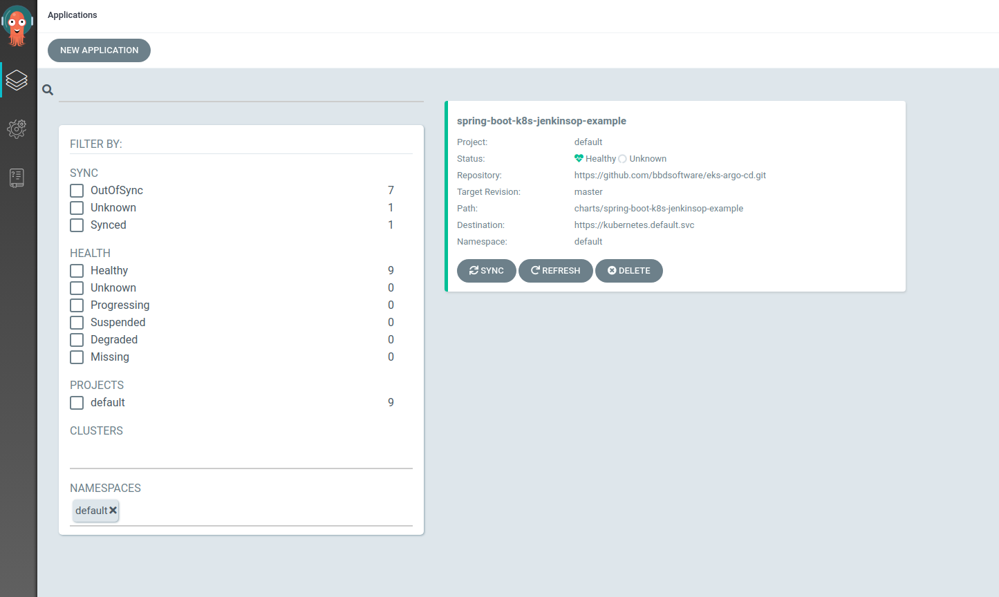

# Example repository containing apps to be deployed via argo cd

Background:

This is **_Part 3_** of a cluster setup 
see the bellow repos for next steps:

* [Part 1 setting up EKS ](https://github.com/bbdsoftware/eks-bootstrap)
* [Part 2 setting up CI](https://github.com/bbdsoftware/eks-jenkins-ci)
* [Part 3 setting up CD ](https://github.com/bbdsoftware/eks-argo-cd)

---
**NOTES**

Please see  https://github.com/bbdsoftware/eks-pring-boot-jenkinsop-example for the example application used in this helm chart.
Please ensure you have competed  https://github.com/bbdsoftware/eks-bootstrap#cd-gitops
---
**Steps:**

* Via manifest 

    Included is an argo application manifest to configure argo to sync the helm manifests to the cluster.  
    Run
    
```    
     kubectl  apply -f   -f argo/argo-application.yaml
```

* Via UI 

    Alternatively you may also use the argo ui to configure this application.
    
Verify

Once this has been applied you can see the application in the argo server ui * 


You can also verify the correct deployment via kubectl

```
    kubctl get all -n default
    NAME                                                                  READY   STATUS         RESTARTS   AGE
    pod/spring-boot-k8s-jenkinsop-example-helm-eks-spring-boot-demltwcj   0/1     ErrImagePull   0          5s
    
    NAME                                                                  TYPE           CLUSTER-IP      EXTERNAL-IP                                                               PORT(S)        AGE
    service/spring-boot-k8s-jenkinsop-example-helm-eks-spring-boot-demo   LoadBalancer   10.100.250.68   a525df411110e11eaba30026fa41b025-2072976599.eu-west-1.elb.amazonaws.com   80:31448/TCP   5s
    
    NAME                                                                          READY   UP-TO-DATE   AVAILABLE   AGE
    deployment.apps/spring-boot-k8s-jenkinsop-example-helm-eks-spring-boot-demo   0/1     1            0           5s
    
    NAME                                                                                     DESIRED   CURRENT   READY   AGE
    replicaset.apps/spring-boot-k8s-jenkinsop-example-helm-eks-spring-boot-demo-76fd6bc7fb   1         1         0       5s

```

